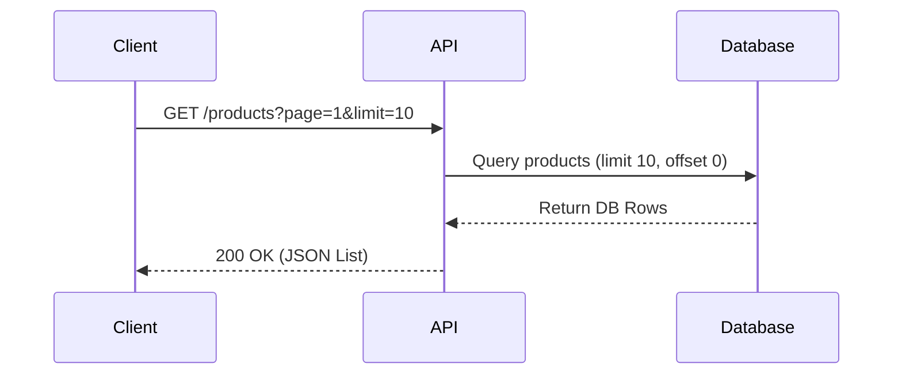

# 📡 API Contract Specification

> [!IMPORTANT]
> This document serves as the single source of truth for the API communication between the client and the server. All distinct changes must be discussed and versioned.

## 📋 Table of Contents
- [Overview](#overview)
- [Authentication](#authentication)
- [Base URL](#base-url)
- [Response Standards](#response-standards)
- [Error Handling](#error-handling)
- [Endpoints](#endpoints)
  - [Users](#users)
  - [Products](#products)
- [Data Models](#data-models)

---

## 🧐 Overview
This API is designed based on RESTful principles. It accepts JSON request bodies, returns JSON responses, and uses standard HTTP response codes.

**Version:** `v1.0.0`  
**Protocol:** `HTTP/1.1` & `HTTP/2`  
**Content-Type:** `application/json`

---

## 🔐 Authentication
All authenticated endpoints require a Bearer Token in the `Authorization` header.

```http
Authorization: Bearer <your_access_token>
```

| Parameter | Type | Description |
| :--- | :--- | :--- |
| `Authorization` | `string` | **Required**. The access token obtained from the login endpoint. |

---

## 🌐 Base URL
Depending on the environment, the base URL differs:

| Environment | URL |
| :--- | :--- |
| **Development** | `http://localhost:3000/api/v1` |
| **Staging** | `https://staging-api.parejiya-parivar.com/v1` |
| **Production** | `https://api.parejiya-parivar.com/v1` |

---

## 📦 Response Standards

### Success Response Structure
All successful responses will follow this envelope structure:

```json
{
  "success": true,
  "data": {
    // Response payload goes here
  },
  "meta": {
    "page": 1,
    "limit": 10,
    "total": 50
  }
}
```

### Error Response Structure
Start standardizing errors to make frontend handling easier:

```json
{
  "success": false,
  "error": {
    "code": "RESOURCE_NOT_FOUND",
    "message": "The requested user details could not be found.",
    "details": null
  }
}
```

---

## ⚠️ Error Handling

| Status Code | Code String | Description |
| :--- | :--- | :--- |
| `400` | `BAD_REQUEST` | The server could not understand the request due to invalid syntax. |
| `401` | `UNAUTHORIZED` | The client must authenticate itself to get the requested response. |
| `403` | `FORBIDDEN` | The client does not have access rights to the content. |
| `404` | `NOT_FOUND` | The server can not find the requested resource. |
| `500` | `INTERNAL_SERVER_ERROR` | The server has encountered a situation it doesn't know how to handle. |

---

## 🚀 Endpoints

### 👤 Users

#### Get User Profile
Retrieves the profile information of the currently authenticated user.

- **Method:** `GET`
- **Path:** `/users/me`
- **Auth Required:** `Yes`

**Success Response (200 OK):**
```json
{
  "success": true,
  "data": {
    "id": "usr_123456789",
    "fullName": "Jane Doe",
    "email": "jane@example.com",
    "role": "admin",
    "createdAt": "2023-10-27T10:00:00Z"
  }
}
```

#### Update User Profile
Updates the user's personal information.

- **Method:** `PATCH`
- **Path:** `/users/me`
- **Auth Required:** `Yes`

**Request Body:**
```json
{
  "fullName": "Jane Smith",
  "avatarUrl": "https://example.com/avatar.png"
}
```

---

### 🛍️ Products

#### List Products
Get a paginated list of products.

- **Method:** `GET`
- **Path:** `/products`
- **Query Parameters:**
  - `page` (number, default: 1)
  - `limit` (number, default: 20)
  - `category` (string, optional)

**Visual Flow:**



**Success Response (200 OK):**
```json
{
  "success": true,
  "data": [
    {
      "id": "prod_001",
      "name": "Wireless Headphones",
      "price": 99.99,
      "inStock": true
    }
  ],
  "meta": {
    "page": 1,
    "limit": 10,
    "total": 150
  }
}
```

---

## 💾 Data Models

### User Object
| Field | Type | Description |
| :--- | :--- | :--- |
| `id` | `string` | Unique identifier for the user. |
| `email` | `string` | User's email address. |
| `fullName` | `string` | Full name of the user. |
| `role` | `enum` | One of `user`, `admin`, `moderator`. |

### Product Object
| Field | Type | Description |
| :--- | :--- | :--- |
| `id` | `string` | Unique identifier. |
| `name` | `string` | Product name. |
| `price` | `number` | Price in USD. |
| `tags` | `string[]` | Array of related tags. |
